## Description
For this evidence, I chose Dart as the base language from which I’m going to extract my grammar.
Dart is a client-optimized programming language developed by Google, it offers a framework for building highly performant applications. By choosing Dart, I hope to improve my understanding of the language and to better exploit its capabilities.


## Models

### Making The Grammar

To simplify the implementation, I'm utilizing a subset of the Dart programming language as the foundation for my grammar. Specifically, I'll focus on crafting a simple grammar for non-anonymous, non-recursive function declarations that will deliberately include ambiguity and left recursion for explanation purposes. Only declarations for non local functions with a non void return type are going to be accounted for. The initial structure is adapted from Dart's official documentation (Dart, n.d.).

#### Proposed Grammar:

- **F** -> Identifier (Parameters) Body | Identifier () Body
- **Identifier** -> DataType name | name
- **Parameters** -> Parameters, Parameters | Identifier
- **Body** -> {} | {content} | {ReturnStatement} | {content ReturnStatement}
- **ReturnStatement** -> return value
- **DataType** -> int | double | String | bool | void

### Eliminating Ambiguity and Left Recursion

With the grammar established, we’ll now focus on making it deterministic to make it easier to use common parsers like NLTK. For this, eliminating both ambiguity and left recursion is needed.

#### Ambiguity in Parameters:

The ambiguity in our grammar originates from the `Parameters` production:
- **Parameters** -> Parameters, Parameters | Identifier

This rule introduces ambiguity, as it allows expressions like `int x, i, String string` to be grouped in multiple ways, leading to different interpretations and Abstract Syntax Trees for the same input string. For example:
- Grouping 1: int x, (i, String string) -> Parameters, (Parameters, T)
- Grouping 2: (int x, i), String string -> (Parameters, T), T

To resolve this, we can introduce an auxiliary non-terminal, **T**, to differentiate groupings clearly:
- **Parameters** -> Parameters, T | T
- **T** -> Identifier

Simplifying further, we refine it to:
- **Parameters** -> Parameters, Identifier | Identifier

#### Resolving Left Recursion:

The `Parameters` rule still exhibits left recursion, which we need to eliminate to prevent parsing issues. By redefining the production to use right recursion through an intermediate state **P**, we can convert the recursion to this:
- **Parameters** -> Identifier P
- **P** -> , Identifier P | ε

Now that we know how to resolve both problems for the `Parameters` production, we can apply the same process to `F` and `Body` productions, the only places where ambiguity or left recursion is left. The result productions would look as follows:

#### Ambiguity in F:
- **F** -> Identifier (ParametersList) Body
- **ParametersList** -> Parameters |  ε

#### Ambiguity in Body:
- **Body** -> {BodyContent}
- **BodyContent** -> ε | content | ReturnStatement | content ReturnStatement

#### Resolving Left Recursion in Body:
- **Body** -> {BodyContent}
- **BodyContent** -> ε | content B’ | ReturnStatement
- **B'** -> ReturnStatement | ε

#### Final Grammar:
With these modifications, our grammar is now free from both ambiguity and left recursion:
- **F** -> Identifier ( ParametersList ) Body
- **Identifier** -> DataType name | name
- **ParametersList** -> Parameters | ε
- **Parameters** -> Identifier P
- **P** -> , Identifier P | ε
- **Body** -> { BodyContent }
- **BodyContent** -> ε | content B | ReturnStatement
- **B** -> ReturnStatement | ε
- **ReturnStatement** -> return value
- **DataType** -> int | double | String | bool


## Implementation

The implementation involves utilizing the grammar to check the given strings against it, with this we effectively determine if they could form part of the language. The implementation can be found in the `dartCFGTester.py` file. Given that it’s easy to make mistakes when giving input to the function, the user will only be able to run the code and see the tests and their results for the example strings. Those same tests will be commented in here with their respective LL1 parsing AST. For the implementation to work, the NLTK module is needed.

This module is used for making it easy to define the Context-Free Grammar (CFG) and for creating the parser and using it:
- It can be installed on Ubuntu with the following command:
  ```bash
  $ sudo apt install python3-nltk
  ```
- Here is a guide to install it on other operating systems: [Guide](https://www.nltk.org/install.html)


## Tests

The `dartCFGTester.py` file contains all of the test cases. As explained before, in this section we are going to put the tests with their given Abstract Syntax Trees, although the invalid strings won’t always have an AST, or at least not a complete one. To obtain the AST, we are going to use the LL(1) Parser Visualization tool from Princeton (Kincaid Z. and Zhu S., n.d.).

### Valid Strings

- **String**: `int name ( int name ) { return value }`
  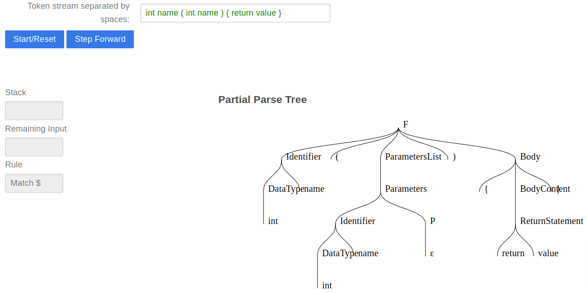

- **String**: `int name ( ) { content return value }`
  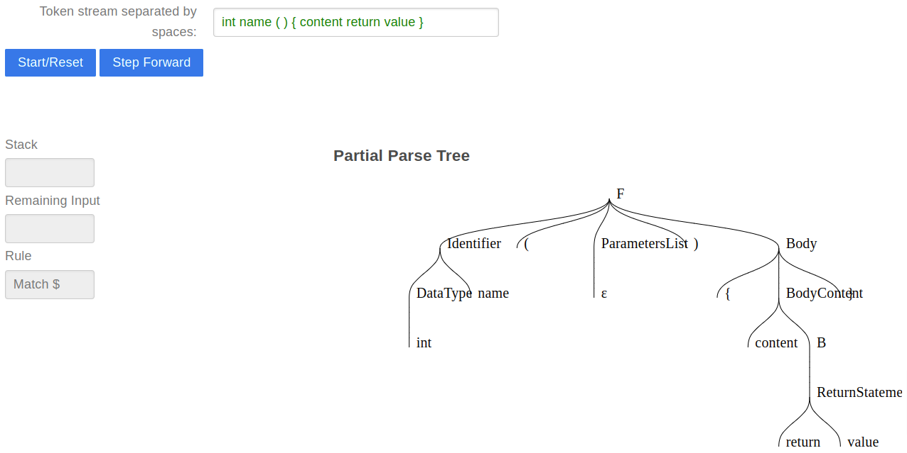

- **String**: `double name ( ) { content return value }`
  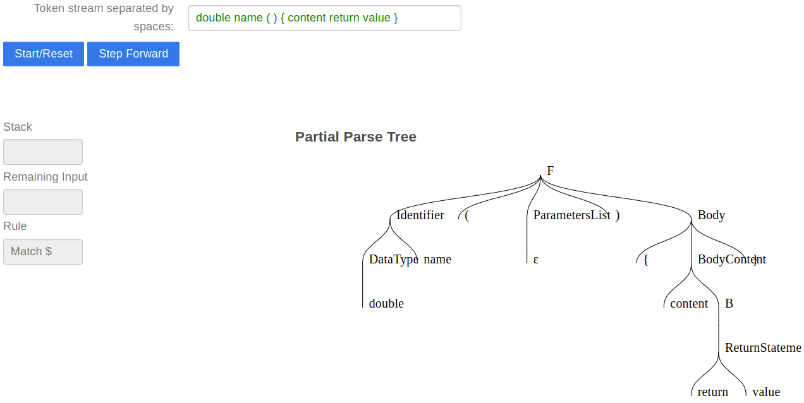

- **String**: `String name ( int name , double name ) { return value }`
  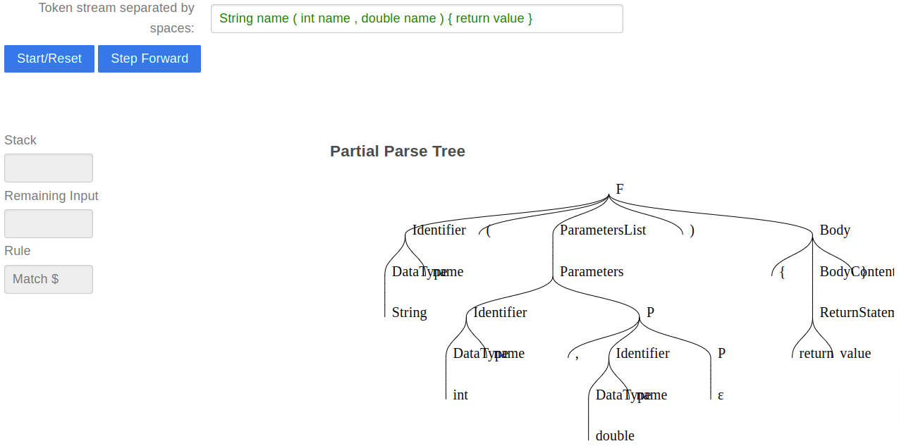

- **String**: `bool name ( String name ) { return value }`
  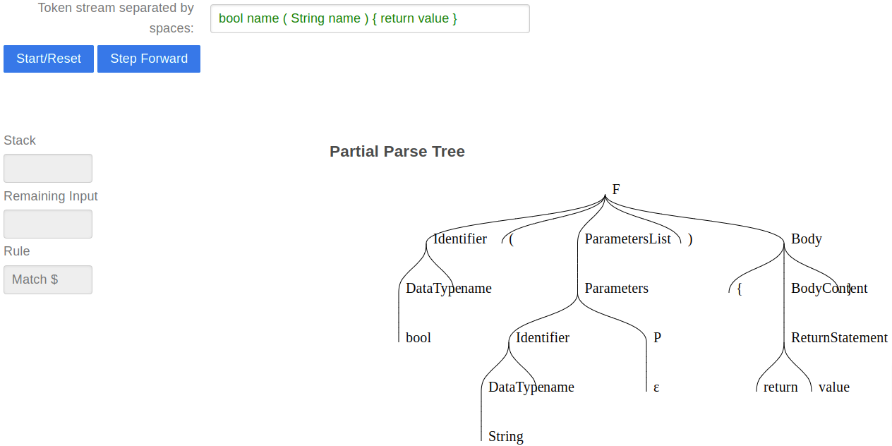


### Invalid Strings

- **String**: `( int name ) { }`
  **Description**: The function name is missing.
  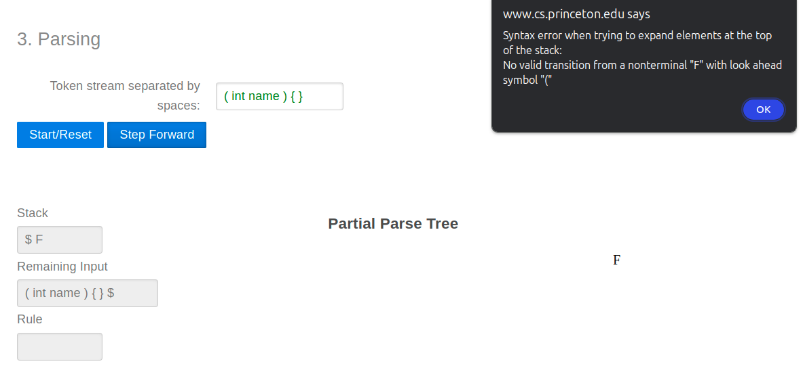

- **String**: `name { content return value }`
  **Description**: The parentheses for parameters are missing.
  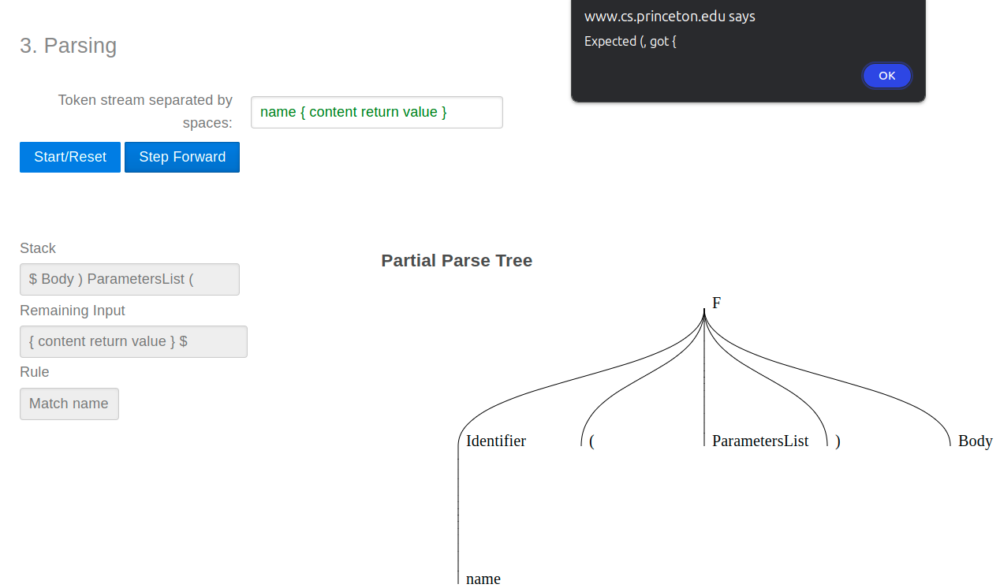

- **String**: `int name ( int name ) { int name ( String char ) { } }`
  **Description**: Local functions declarations are not supported by the proposed grammar as detailed above.
  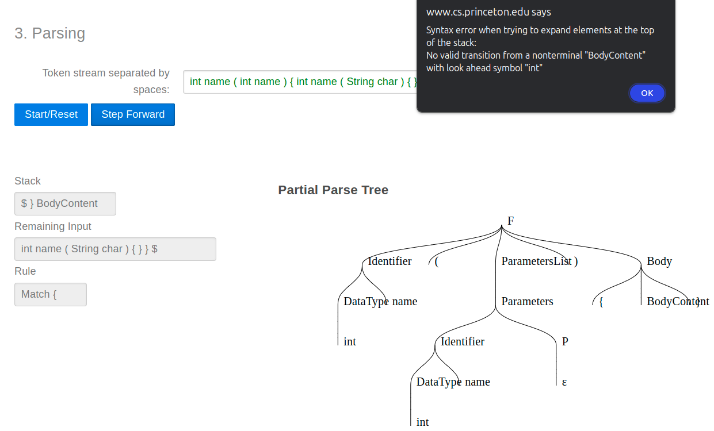

- **String**: `name ( int name ) { return }{}`
  **Description**: The “value” to be returned is missing.
  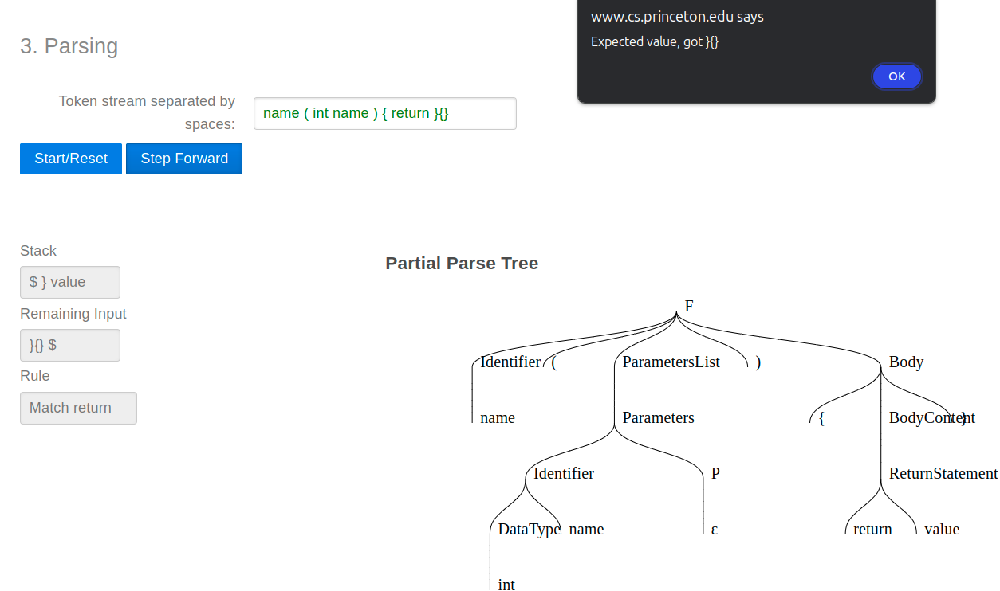

- **String**: `int name ( int name ) content return value`
  **Description**: The curly brackets of the function body are missing.
  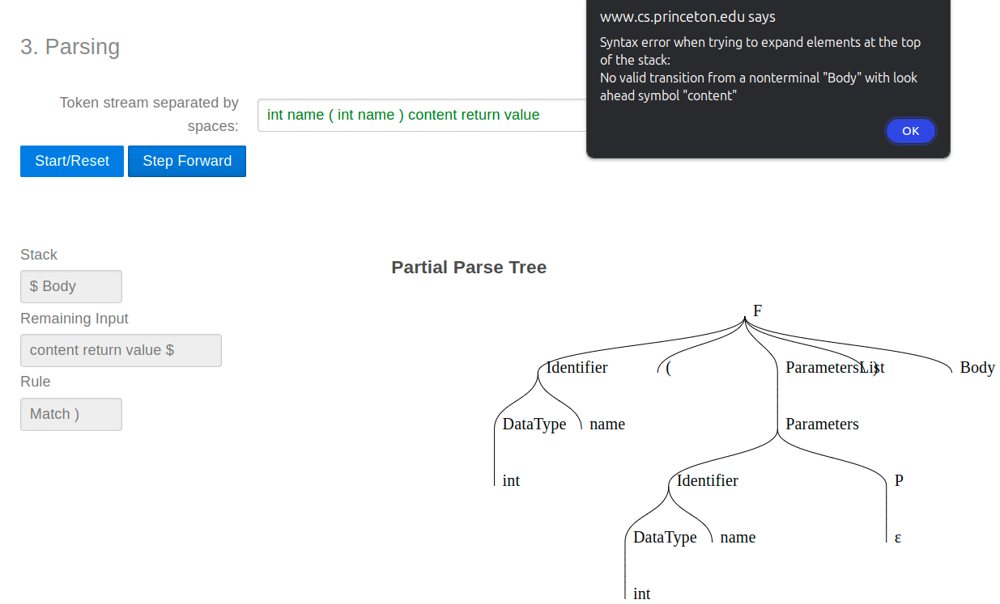

- **String**: `double name ( String name , int name )`
  **Description**: The body as a whole is missing.
  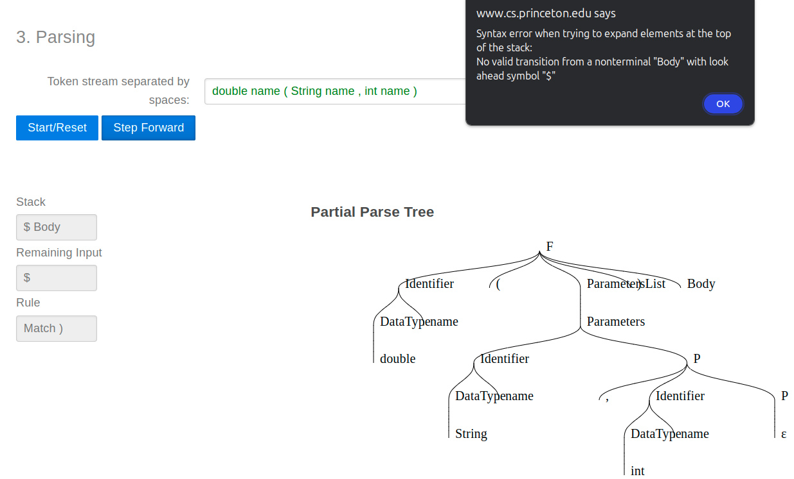


## Analysis

### Time Complexity
The primary factor determining the time complexity of our code is the time complexity of the parsing process. Our implementation uses an Earley Parser. According to the NLTK documentation, this top-down parser incrementally builds a parse chart by adding edges representing hypotheses about the tree structure for subsequences of the text. It can handle all context-free grammars, including those with recursion and ambiguity.

The Earley parser is efficient for a wide range of grammars, with a time complexity that can vary:
- **Best Case**: Ω(n)
- **Average Case**: Θ(n^2)
- **Worst Case**: O(n^3)

These variations depend on the specific structure of the grammar and the input. For unambiguous and optimized grammars like ours, the Earley parser often performs closer to O(n) time complexity, where n is the length of the input.

By eliminating ambiguity and left recursion from our grammar, we significantly optimize the parsing process. Each token can be processed more efficiently, reducing unnecessary hypothesis testing. Consequently, the typical time complexity of our application is closer to O(n). The efficiency largely depends on how optimized the grammar is and the specific characteristics of the input.

### Alternative Solution
Another way to parse the input strings with our grammar would have been to use the Recursive Descent Parser. This parser also employs a top-down approach but works by recursively expanding and matching the nodes of a syntactic tree against the input text. If a token fails to match, the parser backtracks to the previous node to try a different branch until all possibilities are exhausted.

To use the Recursive Descent Parser, we would simply change the parser variable declaration to the following line:
```python
parser = RecursiveDescentParser(grammar)
```

While the Recursive Descent Parser is simpler to implement and understand, it can be less efficient for complex or ambiguous grammars, potentially resulting in a time complexity approaching O(2^n) where n is the number of decision points in the parsing tree. By eliminating ambiguity and left recursion from our grammar, we could improve its efficiency to operate closer to O(n), similar to the Earley Parser in optimized scenarios. However, the Earley Parser has the benefit that even for the worst scenarios it performs better than the Recursive Descent Parser, making it the best choice between the two.

### Type Of Grammar

To determine the type of grammar we created, we first need to understand the definitions of the grammar types (Geeksforgeeks, 2023):
- **Type 0 (Unrestricted Grammar)**: The most general type, encompassing all formal grammars. They can recognize any language that a Turing Machine can and have no restrictions.
- **Type 1 (Context-Sensitive Grammar)**: These grammars generate context-sensitive languages and are processed by linear-bounded automata. They handle dependencies and structures that require contextual information.
- **Type 2 (Context-Free Grammar)**: These grammars generate context-free languages, capable of handling nested structures and nested loop constructions.
- **Type 3 (Regular Grammar)**: These grammars generate regular languages, typically used to describe tokenizable patterns. They are limited to hard-coded patterns and cannot handle nested structures.

Our grammar falls under the **Type 2** category, making it a Context-Free Grammar. This is because:
- The grammar rules have a single non-terminal on the left-hand side and a string of terminals and/or non-terminals on the right-hand side.

Some of the characteristics of our grammar include:
- **Non-Terminals and Terminals**: It uses non-terminals like `F`, `Identifier`, etc., and terminals like `int`, `double`, etc., along with balanced constructs like parentheses and curly brackets.
- **Recursive Structures**: The grammar allows for recursive structures, particularly in the `Parameters` and `Body` rules, a common trait of context-free grammars.

#### Why It Is Context-Free and Not Any Other Level

Our grammar is specifically a context-free grammar and not part of other levels for the following reasons:
- **Not Regular (Type 3)**: Regular languages cannot handle balanced structures that require a stack-like memory, which is essential for our grammar.
- **Not Context-Sensitive (Type 1)**: Context-sensitive languages can handle more complex dependencies that require the context of the non-terminals. This is a trait we don’t require for our grammar.
- **Not Recursively Enumerable (Type 0)**: Although Type 0 grammars can describe any computable language, they offer more power than needed for our parsing requirements.

In conclusion, our grammar fits the criteria of a context-free grammar (Type 2) because it efficiently handles nested structures and recursive patterns without needing the additional complexity of context-sensitive or recursively enumerable grammars.
